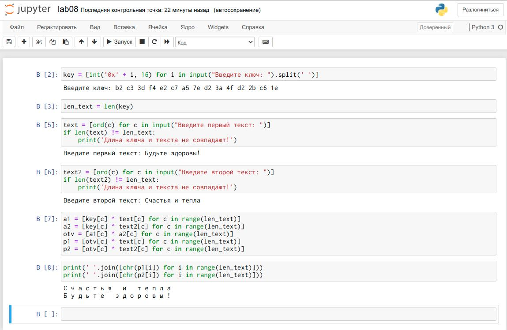

---
## Front matter
lang: ru-RU
title: Лабораторная работа №8. Элементы криптографии. Шифрование (кодирование) различных исходных текстов одним ключом
author: Захарова Софья Михайловна

## Formatting
toc: false
slide_level: 2
##theme: metropolis
mainfont: PT Serif 
romanfont: PT Serif
sansfont: PT Sans
monofont: PT Mono
header-includes: 
## - '\metroset{progressbar=frametitle,sectionpage=progressbar,numbering=fraction}'
 - '\makeatletter'
## - '\beamer@ignorenonframefalse'
 - '\makeatother'
aspectratio: 43
section-titles: true
---
# Цель работы

Освоить на практике применение режима однократного гаммирования на примере кодирования различных исходных текстов одним ключом.

---
# Задание

Кодирование различных исходных текстов одним ключом.

---
# Выполнение лабораторной работы

1. Перейдем к написанию кода программы. Генерируем случайный ключ, соответствующий длине текста, который мы хотим кодировать. Вводим два сообщения. Применяя алгоритм, указанный в условии лабораторной работы, получаем, что можем расшифровать сообщения. Т.е. если злоумышленник знает одно из закодированных сообщений по одному ключу, то он сможет расшифровать и (уменьшить область поиска) другие сообщения, закодированные по тому же ключу (рис.1).

{ #fig:001 width=50% }

---

2. Ответы на контрольные вопросы: 
1) Как, зная один из текстов ( или ), определить другой, не зная при этом ключа?
С помощью формул режима однократного гаммирования получим шифротексты обеих телеграмм. Задача нахождения открытого текста по известному шифротексту двух телеграмм, зашифрованных одним ключом, может быть решена. Складываем по модулю 2 оба равенства. Если один из текстов известен — т.е. имеет фиксированный формат, в который вписываются значения полей, и нам известен этот формат, то тогда получим достаточно много пар. Таким образом, получаем возможность определить те символы сообщения , которые находятся на позициях известного шаблона сообщения.В соответствии с логикой сообщения , у нас есть реальный шанс узнать ещё некоторое количество символов сообщения . Затем вновь используем предыдущее равенство с подстановкой вместо полученных на предыдущем шаге новых символов сообщения . И так далее. Действуя подобным образом,
даже если не прочитаем оба сообщения, то значительно уменьшим пространство их поиска.

---

4. 2) Что будет при повторном использовании ключа при шифровании текста?
Если на сообщение наложить ключ дважды, мы получим исходное сообщение.

---

5. 3) Как реализуется режим шифрования однократного гаммирования одним ключом двух открытых текстов?
Один ключ накладываем на оба открытых текста и получаем два зашифрованных одним ключом шифротекста.

---

6. 4) Перечислите недостатки шифрования одним ключом двух открытых текстов.
При условии, что злоумышленник знает о том, что ключ шифрования един и он получил одну из пар текстов (зашифрованный текст и открытый), то он может найти ключ (см. вопрос 1) и расшифровать остальные тексты.

---

7. 5) Перечислите преимущества шифрования одним ключом двух открытых текстов.
Это позволяет упростить разработку шифровальных и дешифровальных систем. Если мы реализуем обмен, например, между двумя компьютерами, то удобно использовать единый ключ для всех данных.

---
# Выводы

В ходе выполнения лабораторной работы я изучила теорию и освоила на практике применение режима однократного гаммирования на примере кодирования различных исходных текстов одним ключом.

---

## {.standout}

Спасибо за внимание!
