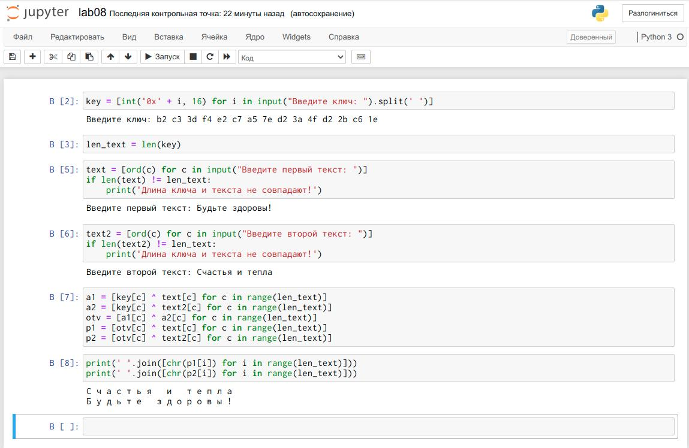

---
# Front matter
title: "Отчёт по лабораторной работе №3"
subtitle: "Дискреционное разграничение прав в Linux. Два пользователя."
author: "Захарова Софья Михайловна"

# Generic otions
lang: ru-RU

# Bibliography
bibliography: bib/cite.bib
csl: pandoc/csl/gost-r-7-0-5-2008-numeric.csl

# Pdf output format
toc: true # Table of contents
toc_depth: 2
lof: true # List of figures
lot: true # List of tables
fontsize: 12pt
linestretch: 1.5
papersize: a4
documentclass: scrreprt
## I18n
polyglossia-lang:
  name: russian
  options:
	- spelling=modern
	- babelshorthands=true
polyglossia-otherlangs:
  name: english
### Fonts
mainfont: PT Serif
romanfont: PT Serif
sansfont: PT Sans
monofont: PT Mono
mainfontoptions: Ligatures=TeX
romanfontoptions: Ligatures=TeX
sansfontoptions: Ligatures=TeX,Scale=MatchLowercase
monofontoptions: Scale=MatchLowercase,Scale=0.9
## Biblatex
biblatex: true
biblio-style: "gost-numeric"
biblatexoptions:
  - parentracker=true
  - backend=biber
  - hyperref=auto
  - language=auto
  - autolang=other*
  - citestyle=gost-numeric
## Misc options
indent: true
header-includes:
  - \linepenalty=10 # the penalty added to the badness of each line within a paragraph (no associated penalty node) Increasing the value makes tex try to have fewer lines in the paragraph.
  - \interlinepenalty=0 # value of the penalty (node) added after each line of a paragraph.
  - \hyphenpenalty=50 # the penalty for line breaking at an automatically inserted hyphen
  - \exhyphenpenalty=50 # the penalty for line breaking at an explicit hyphen
  - \binoppenalty=700 # the penalty for breaking a line at a binary operator
  - \relpenalty=500 # the penalty for breaking a line at a relation
  - \clubpenalty=150 # extra penalty for breaking after first line of a paragraph
  - \widowpenalty=150 # extra penalty for breaking before last line of a paragraph
  - \displaywidowpenalty=50 # extra penalty for breaking before last line before a display math
  - \brokenpenalty=100 # extra penalty for page breaking after a hyphenated line
  - \predisplaypenalty=10000 # penalty for breaking before a display
  - \postdisplaypenalty=0 # penalty for breaking after a display
  - \floatingpenalty = 20000 # penalty for splitting an insertion (can only be split footnote in standard LaTeX)
  - \raggedbottom # or \flushbottom
  - \usepackage{float} # keep figures where there are in the text
  - \floatplacement{figure}{H} # keep figures where there are in the text
---

# Цель работы

Получение практических навыков работы в консоли с атрибутами файлов для групп пользователей.

# Задание

Лабораторная работа подразумевает работу с виртуальной машиной VirtualBox, операционной системой Linux, дистрибутивом Centos и закрепление теоретических основ получения практических навыков работы в консоли с атрибутами файлов для групп пользователей.

# Выполнение лабораторной работы

Создадим учётную запись первого пользователя с именем guest и зададим пароль (рис.1).

{ #fig:001 width=70% }

Создадим учётную запись второго пользователя с именем guest и зададим пароль (рис.2).

{ #fig:001 width=70% }

Добавляем пользователя guest2 в группу guest (рис.3). 

{ #fig:001 width=70% }

Осуществляем вход в систему от двух пользователей на двух разных консолях: guest на первой консоли и guest2 на второй консоли, для обоих пользователей командой pwd определяем директорию, в которой находимся и сравниваем её с приглашением командной строки. Для первого (рис.4): 

{ #fig:001 width=70% }

Для второго (рис.5):

{ #fig:001 width=70% }

Уточняем имя пользователя, его группу, кто входит в неё и к каким группам принадлежит он сам и определяем командами groups guest и groups guest2, в какие группы входят пользователи guest и guest2 (рис. 6).

{ #fig:001 width=70% }

Сравниваем выводы команд groups с выводом команд id –Gn и id –G (рис.7).

{ #fig:001 width=70% }

Пользователи находятся в домашней директории пользователя smzakharova1.
guest состоит в группе guest с id 1001, а guest2 состоит в группах guest и guest2,
то есть в группах id 1001 и 1002.

Сравниваем полученную информацию с содержимым файла /etc/group. Просмотрим файл командой cat /etc/group (рис. 8).

{ #fig:001 width=70% }

От имени пользователя guest2 выполняем регистрацию пользователя guest2 в группе guest командой newgrp guest (рис. 9).

{ #fig:001 width=70% }

От имени пользователя guest изменяем права директории /home/guest, разрешив все действия для пользователя группы: chmod g+rwx /home/guest и снимаем с директории /home/guest/dir1 все атрибуты командой chmod 000 dir1, а также проверяем правильность снятия атрибутов (рис. 10).

{ #fig:001 width=70% }

Меняя атрибуты у директории dir1 и файла file1 от имени пользователя guest и делая проверку от пользователя guest2, заполняем таблицу 3.1, определив опытным путём, какие операции разрешены, а какие нет. Если операция разрешена, заносим в таблицу знак «+», если не разрешена, знак «-». Сравниваем таблицу 1 и таблицу из предыдущей лабораторной работы (рис.11-13).

{ #fig:001 width=70% }

{ #fig:001 width=70% }

{ #fig:001 width=70% }

На основании заполненной таблицы определяем те или иные минимально необходимые права для выполнения пользователем guest2 операций внутри директории dir1 и заполняем таблицу 2 (рис.14).

{ #fig:001 width=70% }

# Выводы

В ходе выполнения работы мы смогли приобрести практические навыки работы в консоли с атрибутами файлов для групп пользователей.
